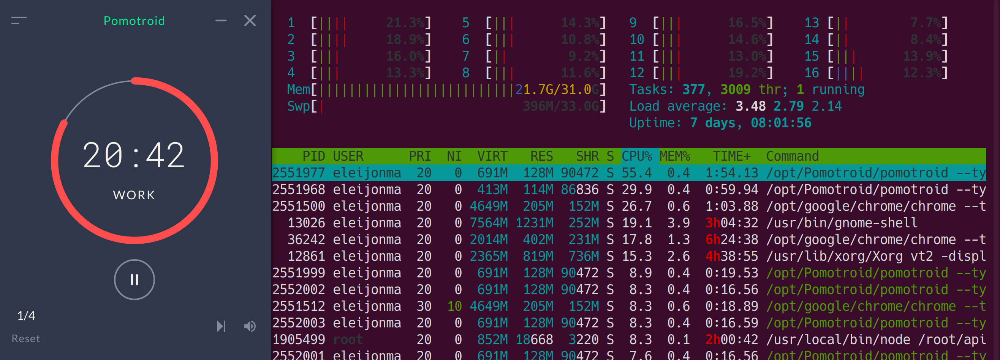

# Pomo

The first ever built and most performant pomodoro timer for your terminal.


## Installation

```bash
$ git clone <repo>
$ cargo run start
```

## Motivation

I love to get productive with my pomodoro timers. However once I made the move to linux, I used Pomotroid which took up 25% to 55% of the CPU (XPS-15 2020) and could not find a alternative.



This is the take to make a pomodoro timer the most performant possible and easy to use through your terminal.

- here we can bind the binary data from the audio directly into the published binary
- all values that can be made static and make use of the lifetime features of Rust has been (or please try to find and we will correct it together. :heart:)

## Improvements

If you find that this could be improved please send in a PR and make benchmarks.

## TODO:

[x] tui-rs implementation of the ui
[x] configuration in form of a configuration file toml
[] possibility to change font in normal mode
[] make it into a zsh view, so basically a terminal window or i3 stdout with the string output from the timer
[] documentation of PR reviews and start up
[] publish
[] add sms notifcations for when the break is over
